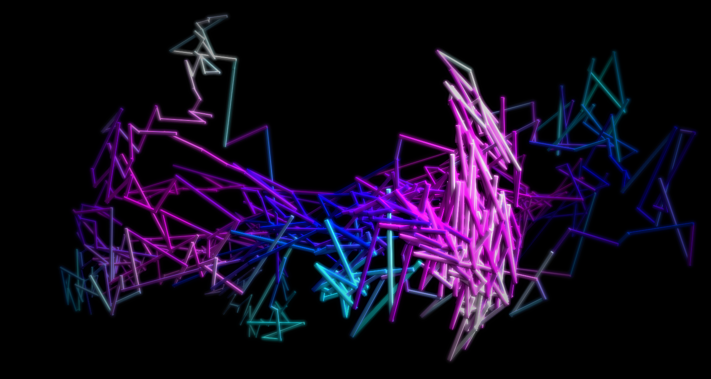

# NeonWave
A little Java app that lets you play with neon lines in 3D space on a black canvas.
Watch them morph and bend around your screen, gravitating toward the center.

Press "R" to toggle 3D mode. It looks pretty cool, but is fairly graphically intensive. Non-GPU users beware.

Click and drag to create waves.

